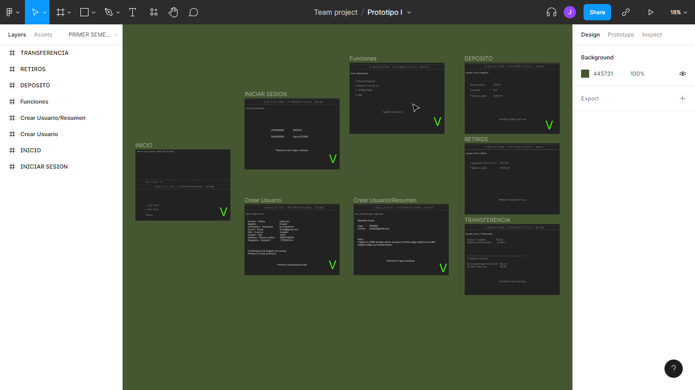
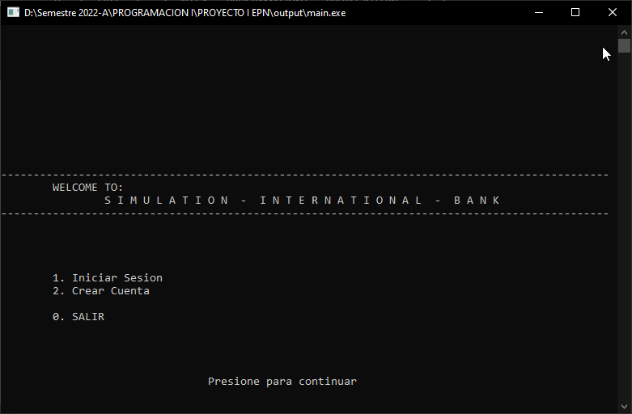
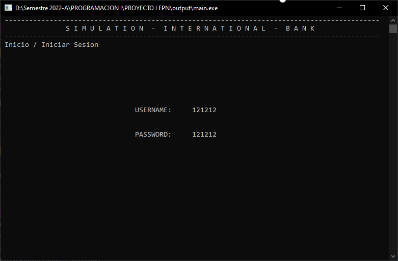
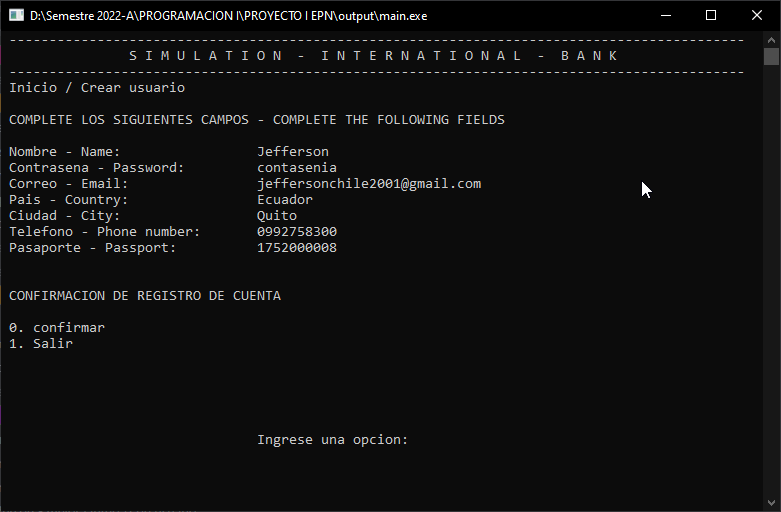

<center> <h1> SIMULATION BANK </h1>
<h2> - PROYECTO I BIMESTRE -
 GRUPO VIII - </h2>
 </center>

------------------------------------------------------
## DEVELOPERS:
- Chileno Jefferson
- Narváez Jhoel
- Palma Darío
------------------------------------------------------
### VARAIBLES GLOBALES Y UX
- Para confirmar cualquier procedimiento 
  
    > Se utilizará el cero `0` para confirmar en todo el programa.

    > Para ingresar a un procedimiento se utilizará numeros. (Los numeros ingresados se usuara como tipo char, a menos que se diga lo contrario)
______________________________________________________


## 18-06-2022

Realizar el prototipo de la aplicacion, esto nos servirá de guia para la creación del programa y poder visulizarlo antes de ser lanzado a producción.

### Interfaz / UX



### Funciones / Interacciones


### Creación de interfaz de sistema

- Interfaz de inicio.
- Interfaz de creación de usuario.
- Interfaz de Inicio de sesion. 
- Realizar animación de entrada

El procedimiento `inicioAnimacion()` ubicado en la carpeta `lib/features.h` simula animación de entrada, esto se logra con un recorrido a cada char de las cadenas con un _Ciclo For_.
```C
char lineas[94] = "----------------------------------------------------------------------------------------------";
char welcome[11] = "WELCOME TO:";
char nameBank[61] = "S I M U L A T I O N  -  I N T E R N A T I O N A L  -  B A N K";
char createUsssssssser[15] = "2. Crear Cuenta";
char iniciarSesssssion[17] = "1. Iniciar Sesion";
char salir[8] = "0. SALIR";
```

El procedimiento `HEADER()` ubicado en la carpeta `lib/features.h` es para dar el encabezado en el programa.
```C
printf(" --------------------------------------------------------------------------------------------\n");
printf("\t\tS I M U L A T I O N  -  I N T E R N A T I O N A L  -  B A N K \n");
printf(" --------------------------------------------------------------------------------------------\n");
```

El metodo `showBarrRotateCenter(int delay)` ubicado en la carpeta `lib/features.h` es para simular un pantalla de carga. 

> El diagrama de flujo se encuentra en `resources/showBarrRotateCenter.drawio` o  [Click aquí](/resources/diagramas/showBarrRotateCenter.drawio)

## 19-06-2022

### Arhivo MAIN en SRC

Estrucura general del programa (bucles, condicionales y switch)

----
Variables usadas:
``` c
char EnterOrExit;
const int DELAY = 100;
int positionUserFree;
```
### ESTRUCTURA PRINCIPAL

`DO WHILE :`

Encargado de mantener en el ciclo hasta que el usuario decida abandonar el programa (como ya se explicó anteriormente usaremos 'cero' para validar operaciones).

#### ESTRUCURA SECUNDARIA
 `IF :`

Dependiendo de la elección del usuario, el programa puede INICIAR SESION, CREAR USUARIO o en su defecto ABANDONAR EL PROGRAMA.

1. `INICIAR SESION`

2. `CREAR USUARIO`

3. `ABANDONAR`
   




## 22-06-2022

### CREACION DE ESTRUCTURA PARA GUARDAR USUARIOS

Estructura `usuario` con las siguientes propiedades

```C
typedef struct
{
    int ID;
    char user[20];
    char password[20];
    char email[30];
    char county[20];
    char city[20];
    char phoneNumber[10];
    char identificationCard[12];
    float cash;
} usuario;
```

> Nota: para el manejo del phoneNumber y identificationCard se usara en formato texto para evitar gasto inncesario de memoria.

#### DANGER !!!

SIMULATION BANK en su version 0.1.0 trabajara con estrucura dentro de la misma aplicacion, en su futura actulización se trabaja con ficheros para el manejo automático de datos.

### PRODECIMIENTO BUSCAR POSICION LIBRE EN LA ESTRUCURA

Procedimiento `searchPositionFree()`Para no equivocarnos en donde debe colocar al nuevo usuario o sobreescriba uno ya creado, creamos esta función para poder buscar una posición libre dentro de la estrucutura.

Esto se ha hecho recorriendo la estructura `usuarios` con una estrucura For que tiene como limite dar 100 itereraciones. Luego con ayuda de un condicional IF preguntamos por una propiedad de la estructura y si el contenido de esa propiedad empieza con `\0` es decir esta vacía, entonces encontramos una posición libre dentro de la estructura de estrucuturas. entonces guardamos el numero de iteración (posición libre) en la variable del `MAIN` llamada `positionUserFree`

Una vez se haya encontrado la posición terminaremos el proceso con un break;


### PRODECIMIENTO CREAR USUARIO

El procedimiento llamado `createNewUser()` en el `MAIN` lo primero que hacemos llamar a `searchPositionFree()` para obtener la posición libre.

Enseguida vamos preguntado al usuario los respectivos datos para llenar la estructura. Antes de cada pregunta se uso `fflush(stdin)` para limpiar el buffer, y evitar inconvenientes en la toma de datos del usuario.


#### ID UNICO

Para indicar este ID lo primero es que generamos un numero aleatorio con ayuda de `ran()` sin embargo esto no fue suficiente, para evitar que el ID de algún usuario se repitiera se implemento una estructura FOR que va iterando la estructura `usuarios` y en cada iteracion pregunta por la propiedad `ID` y si encuentra un ID igual, vuelve a ejecutar `rand()`.

Pero no esto tampoco fue suficiente, porque lo unico que hizo es que la nueva posición que antes sea era igual, la cambio, pero existe la posibilidad que en iteraciones anteriores a esta se encuentre un ID igual al que recien se ha cambiado, es por esta razon que si encuentra un ID igual lo cambia pero la estrucura for se reinicia para volver a preguntar desde el principio de la estrucutura verificando que no haya ID iguales. Con esto hemos garantizado que el ID siempre sea UNICO y ahora estmos autorizados a guardar el ID en la estructura.

`CREACION DE USUARIO`

Llamamos al procedimiento `createNewUser()`  para crear un nuevo usuarios pero ante de salir preguntamos al usuario con un IF si desea guardar los datos o no, dado que si no desea entonces no debemos guardar la información ingresesa

>> !!! PARA LA PROXIMA ACTULIZACIÓN SE USARA VARAIBLES AUXILIARES PARA REALIZAR ESTE PROCESO 

Si el usuario desea que se guarde los datos, entonces se guardara en un fichero externo.

Por último, si usuario haya o no guardado los datos, entonces se dirigen a la pantalla de inincio.





## iNICIO DE SESION 
- Primero declaramos las variables buscar: buscarID;
    buscarpass y result que seran las principales variables a usar. 
- Ya declaradas estas variables usaremos "system("cls")" para limpiar la consola para asi despues continuar con el programa.
- Presentaremos el encabezado "HEADER" y se presentara el espacio para que pueda escribir su " username" para que gracias a la funcionn "SCANF" lo que se escriba en la consola sea guardado en la variable "buscarID". 
- A continuacion se presentara el espacio para que pueda escribir su "password" y de la misma manera la funcion "SCANF" pueda guardarlo en la funcion "buscarpass".
-Una vez que ya se haya ingresado usuario como contraseña usaremos un if que sera el encargado de recorrer el arreglo donde se encuentran los usuarios y las contraseñas existentes en el programa(dicho arreglo se encuentra en la libreria "JeffTools.h"), si el usuario o la contraseña esta mal el programa no podra avanzar caso contrario le presentaran las opciones que posee el programa.

`DEPOSITO`
Realizamos la funcion `deposito` a traves de codigos en lennguaje C. se utilizaron las siguientes variables:
* int positionUserFree
* float deposito.
Despues utilizamos un "system("cls")", para limpiar la consola.
Utilizamos lo siguiente:
`PRINTF`: Utilizamos para que mande a imprimir en la consola.
`SCANF`: Para leer varios datos como los que utilizamos.
`usuarios[ ].cash += deposito`: Utlizamos esta funcion para calcular el valor total que tiene la cuenta.

Imprimimos en la consola el encabezado del procedimiento `deposito` 
## Ingrese Numero de Cuenta - 22-06-2022 
En esta parte pedimos al usurio que ingrese su numero de ID, toda la informacion esta en la libreria [feautures.h] en la parte de {usuario[]}.   
Cuando encontramos el numero de cuenta procedemos al siguiente paso.
## Dinero a ingresar - 23-08-2022 
Pedimos el monto a depositar, con el mensaje  `dinero a ingresar` para almacenar el monto a depositar utilizamos la variable [deposito].Con la operacion `usuarios[ ].cash += deposito`  calculamos el deposito mas el dinero que tiene en la cuenta.
## Dinero - 23-06-2022
Al final se muestra el monton total del deposito.
NOTA:
> Toda la informacion de las cuentas esta en la libreria [feautures.h].